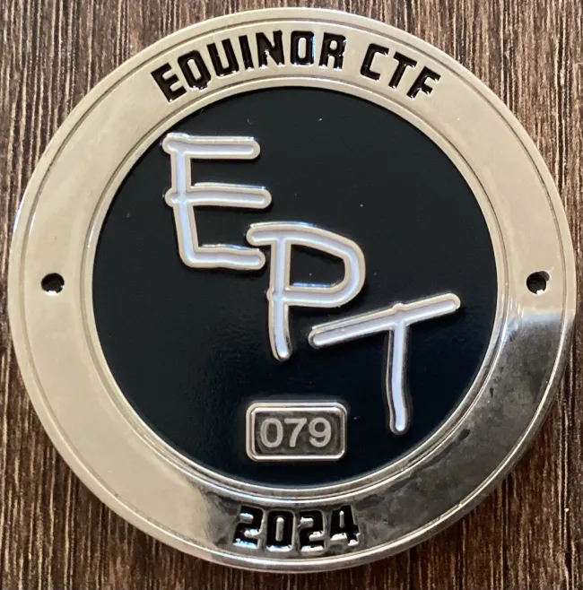

  

    <a href="/Writeups/" style="text-decoration: none; font-weight: bold;">Writeups</a>
  

  

  

    <a href="/" style="text-decoration: none; font-weight: bold;">About</a>
  

  

  

    <a href="/Studies/" style="text-decoration: none; font-weight: bold;">Studies</a>
  

  

  

    <a href="/Achievements/" style="text-decoration: none; font-weight: bold;">Achievements</a>
  

# Achievements
###  I captured a unique CTF Coin with number 79 at Equinor CTF 2024.

