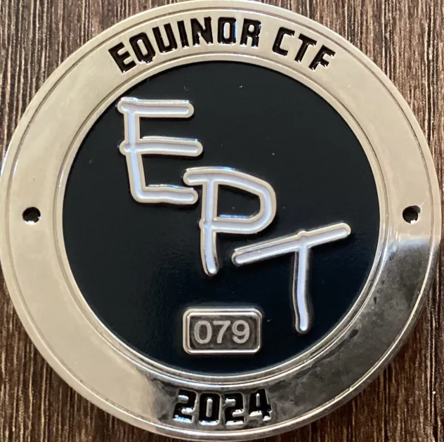

<link rel="stylesheet" href="/assets/style.css">

  
<a href="/writeups/">Writeups</a>

  

  
<a href="/">About</a>

  

  
<a href="/studies/">Studies</a>

  

  
<a href="/achievements/">Achievements</a>

<h1 style="text-align: center;">Achievements</h1>
<h3 style="text-align: center;">I captured a unique CTF Coin with number 79 at Equinor CTF 2024.</h3>

  
  

