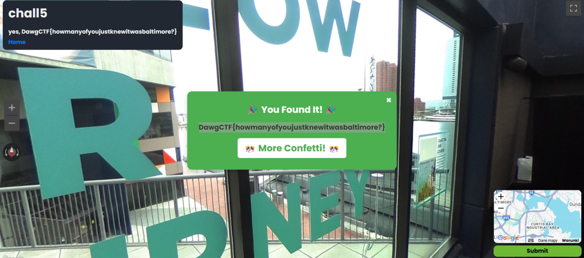

# DawgCTF 2025 - GEOSINT challenges

### Table of contents:
  [GEOSINT chall1](#geosint-chall1) 
  [GEOSINT chall2](#geosint-chall2) 
  [GEOSINT chall4](#geosint-chall4) 
  [GEOSINT chall5](#geosint-chall5) 
  [GEOSINT chall7](#geosint-chall7) 
  [GEOSINT chall8](#geosint-chall8) 
  [GEOSINT chall11](#geosint-chall11) 
  [GEOSINT chall12](#geosint-chall12) 

This is an easy challenge. The unique logo should catch attention, so the team name can be identified. So [Albertsons Stadium](https://www.google.com/maps/place/Albertsons+Stadium/@43.6026366,-116.1984099,17z/data=!3m1!4b1!4m6!3m5!1s0x8646819ce03a452f:0xaa2b000d8bf5c58d!8m2!3d43.6026327!4d-116.195835!16zL20vMDYydmdt?entry=ttu&g_ep=EgoyMDI1MDQyOS4wIKXMDSoASAFQAw%3D%3D) is found. 

### GEOSINT - chall2

A signboard with the text `PROMOTE YOUR COMPANY 9947 0148` can be seen. Searching the phrase reveals an article. The article [article](https://netnews.com.mt/2017/04/05/ftemp-ta-ftit-sighat-fi-tmiem-il-gimgha-kriminalita-ta-kull-xorta-tgholli-rasha/_dsc8876/), contains text in Maltese is identified: `It-triq fejn seħħ l-inċident li fih omm Marokkina kienet imġiegħla tagħmel abort`. It suggests that the country being searched for might be Malta. Also, a café is noticed in the background, and eventually, the exact  [place](https://www.google.com/maps/@35.9211266,14.4792146,3a,75y,143.26h,79.96t/data=!3m7!1e1!3m5!1ssrRZghZ4ohX8M7xR0m2XQA!2e0!6shttps:%2F%2Fstreetviewpixels-pa.googleapis.com%2Fv1%2Fthumbnail%3Fcb_client%3Dmaps_sv.tactile%26w%3D900%26h%3D600%26pitch%3D10.03979575213613%26panoid%3DsrRZghZ4ohX8M7xR0m2XQA%26yaw%3D143.2649363650284!7i16384!8i8192?entry=ttu&g_ep=EgoyMDI1MDQyMi4wIKXMDSoASAFQAw%3D%3D) is determined.

### GEOSINT - chall4

This line of buildings is very characteristic. Then [Panama City](https://www.google.com/maps/@8.9561605,-79.5298355,3a,75y,15.93h,90.89t/data=!3m7!1e1!3m5!1sNUkquHWq51RHePSW1lOACQ!2e0!6shttps:%2F%2Fstreetviewpixels-pa.googleapis.com%2Fv1%2Fthumbnail%3Fcb_client%3Dmaps_sv.tactile%26w%3D900%26h%3D600%26pitch%3D-0.8862619476891211%26panoid%3DNUkquHWq51RHePSW1lOACQ%26yaw%3D15.931751916758685!7i16384!8i8192?entry=ttu&g_ep=EgoyMDI1MDQyOS4wIKXMDSoASAFQAw%3D%3D) can be located quickly.

### GEOSINT - chall5

A distinctive ship is visible outside. If the ship is recognized, the location, the [National Aquarium](https://www.google.com/maps/place/National+Aquarium/@39.2853969,-76.6109733,17z/data=!3m1!4b1!4m6!3m5!1s0x89c80362e467565d:0xc7f0a8617c7c7e8e!8m2!3d39.2853928!4d-76.6083984!16zL20vMDF5bTBm?entry=ttu&g_ep=EgoyMDI1MDQyOS4wIKXMDSoASAFQAw%3D%3D), can be identified.

### GEOSINT - chall7

Reading the banner text is enough to identify the location. The caption reads 'National Aquarium is a Seafood Watch Partner with Monterey Bay Aquarium,' indicating it's near the location from chall5 — [National Aquarium](https://www.google.pl/maps/@39.2845641,-76.6069082,2a,75y,340.31h,75.46t/data=!3m8!1e1!3m6!1sk25wj64XH0MUZfDv2EQctA!2e0!3e2!6shttps:%2F%2Fstreetviewpixels-pa.googleapis.com%2Fv1%2Fthumbnail%3Fcb_client%3Dmaps_sv.tactile%26w%3D900%26h%3D600%26pitch%3D14.537973204955051%26panoid%3Dk25wj64XH0MUZfDv2EQctA%26yaw%3D340.3142740111357!7i13312!8i6656?entry=ttu&g_ep=EgoyMDI1MDQyOS4wIKXMDSoASAFQAw%3D%3D).

### GEOSINT - chall8

The brick building on the left helps pinpoint the location: [803 Cleveland Avenue, Kansas City, MO](https://www.google.com/maps/@39.1030261,-94.5373659,3a,87.5y,165.17h,95.13t/data=!3m7!1e1!3m5!1sEadzK-owakUgd8fDukONMA!2e0!6shttps:%2F%2Fstreetviewpixels-pa.googleapis.com%2Fv1%2Fthumbnail%3Fcb_client%3Dmaps_sv.tactile%26w%3D900%26h%3D600%26pitch%3D-5.1262195966293405%26panoid%3DEadzK-owakUgd8fDukONMA%26yaw%3D165.17036820495142!7i16384!8i8192?entry=ttu&g_ep=EgoyMDI1MDQyMi4wIKXMDSoASAFQAw%3D%3D).

### GEOSINT - chall11

This [location](https://www.google.com/maps/@-65.1754999,-64.1357407,3a,75y,189.04h,84.22t/data=!3m7!1e1!3m5!1s_3RTE7UfztNnpXUp0MAPUQ!2e0!6shttps:%2F%2Fstreetviewpixels-pa.googleapis.com%2Fv1%2Fthumbnail%3Fcb_client%3Dmaps_sv.tactile%26w%3D900%26h%3D600%26pitch%3D5.780000000000001%26panoid%3D_3RTE7UfztNnpXUp0MAPUQ%26yaw%3D189.04!7i13312!8i6656?entry=ttu&g_ep=EgoyMDI1MDQyOS4wIKXMDSoASAFQAw%3D%3D) can be identified by searching for a building with a similar appearance.

### GEOSINT - chall12

I cropped a part of the photo showing a ticket office. I found an [article](https://www.anixter.com/content/dam/Suppliers/Peerless-AV/Washington%20Metropolitan%20Area%20Transit%20Authority_0.pdf) suggesting that the location is a station within [the Washington Metropolitan Area Transit Authority](https://www.google.com/maps/@38.8937802,-76.8682402,3a,60y,254.02h,92.94t/data=!3m7!1e1!3m5!1sCIHM0ogKEICAgICX5eCyHQ!2e10!6shttps:%2F%2Flh3.googleusercontent.com%2Fgpms-cs-s%2FAB8u6HaxwY8mTpCSGqyGKvwU24uhsYYwUhkJy1N2fWcRJukDriQJSQDvBq2gEi_U3c2FM02J-VOI9dZu-TyH787MafMhhioAUHWFOEdvX60LjNDRfKMYjxPvE9jKbSSzKnRO0uc_itw%3Dw900-h600-k-no-pi-2.9362359762327372-ya118.00731356785954-ro0-fo100!7i12250!8i6125?entry=ttu&g_ep=EgoyMDI1MDQyMi4wIKXMDSoASAFQAw%3D%3D) can be found.

